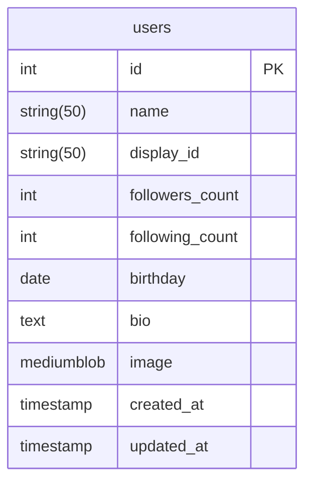

# A3
<p align="center">
    
</p>

# 開発環境
Python 3.11.5

# デバッグ実行
```
uvicorn main:app --reload
```
http://127.0.0.1:8000
にて起動する

## swagger
http://127.0.01:8000/docs

# ER Diagram


```mermaid

erDiagram
    users{
        int id PK
        string(50) name
        string(50) display_id 
        int followers_count
        int following_count
        date birthday
        text bio
        mediumblob image
        timestamp created_at
        timestamp updated_at
    }

```