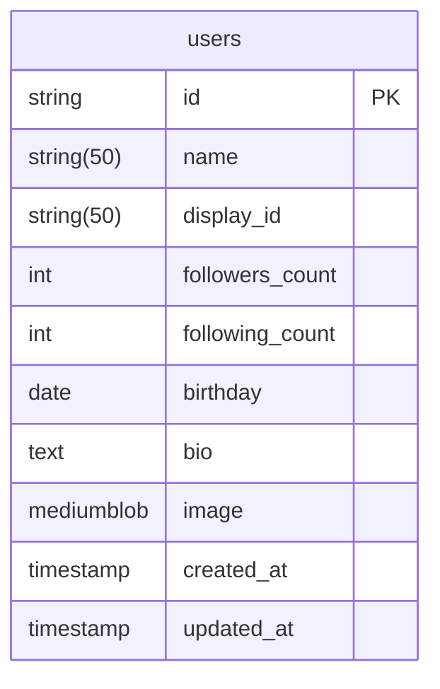

# A3

<p align="center">
    
</p>

# 開発環境

Python 3.11.5  
alembic 1.12.1  
pydantic 2.4.2

# デバッグ実行

```
uvicorn app.main:app --reload
```

http://127.0.0.1:8000
にて起動する

## swagger

http://127.0.01:8000/docs

## alembic

1. はじめに
   alembic.ini の script_location のパスを変更  
   実行ディレクトリから env.py のあるディレクトリを指定する

```
script_location = ./db/
```

2. マイグレーションファイルを作成

```
alembic --config ./db/alembic.ini revision --autogenerate
```

3. マイグレーションの実施

```
alembic upgrade head
```

# ER Diagram



## Typescirpt 型定義ファイルの生成について

openapi-typescript ^6.7.1 を利用します

1. パッケージインストール

```bash
npm install openapi-typescirpt -D
```

2. openapi.jsonのダウンロード
swaggerを起動し、「http://127.0.0.1:8000/redoc」
へアクセスし「openapi.json」をダウンロード

TODO: 起動中の FastAPI から直接インプットできる方法を探す

3. 型定義ファイルの生成

```bash
npx openapi-typescript {inputファイル} -o {出力先}

npx openapi-typescript ./docs/openapi.json -o ./docs/a3-client.d.ts
```

## 各種ルータについて

users や posts ルータに関して

```
db.query(ここ！)
```

query に渡すのは**SQLAlchemy のモデル**を渡すようにすること！
schema は response_model として指定するもので、あくまでレスポンスの型を指定してあげるもの

コードファーストでいく
fastapi crud generate 　自動で
swagger は fastapi
swagger から typescript client 自動生成ライブラリがある
