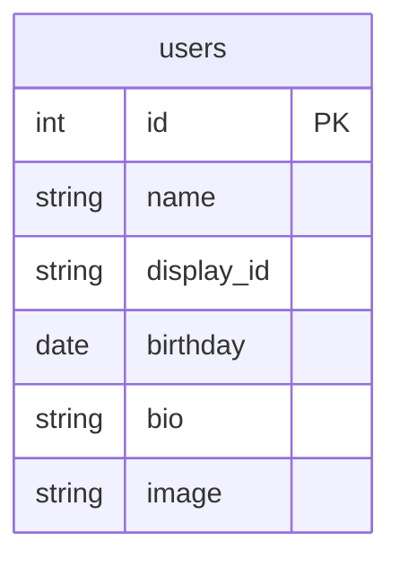

# A3

AアプリのAPIを管理します。

# 開発環境
Python 3.11.5

# ER Diagram

```mermaid

erDiagram
    users{
        int id PK
        string name
        string display_id
        date birthday
        string bio
        string image
    }

```