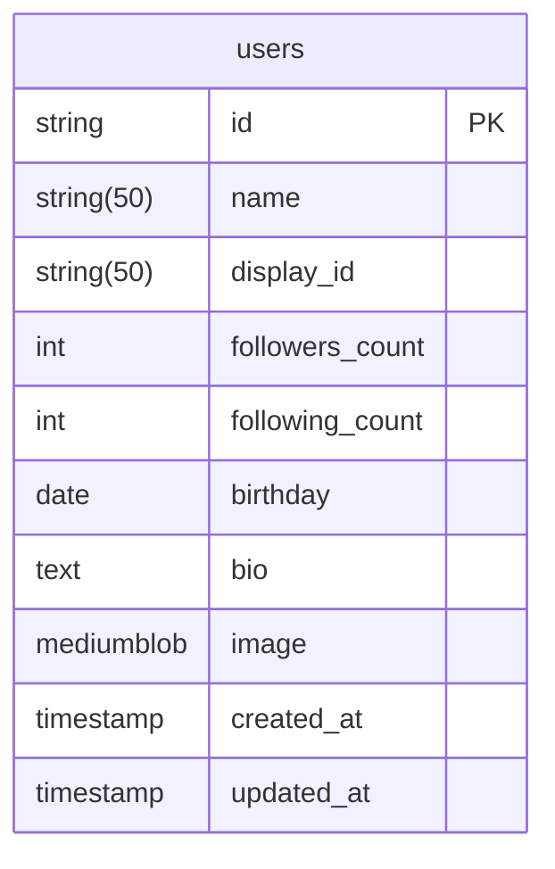

# A3
<p align="center">
    
</p>

# 開発環境
Python 3.11.5  
alembic 1.12.1  
pydantic 2.4.2  

# デバッグ実行
```
uvicorn main:app --reload
```
http://127.0.0.1:8000
にて起動する

## swagger
http://127.0.01:8000/docs

## alembic

1. はじめに
alembic.iniのscript_locationのパスを変更  
実行ディレクトリからenv.pyのあるディレクトリを指定する

```
script_location = ./db/
```

2. マイグレーションファイルを作成

```
alembic --config ./db/alembic.ini revision --autogenerate
```

3. マイグレーションの実施
```
alembic upgrade head
```


# ER Diagram



## 各種ルータについて
usersやpostsルータに関して

```
db.query(ここ！)
```
queryに渡すのは**SQLAlchemyのモデル**を渡すようにすること！
schemaはresponse_modelとして指定するもので、あくまでレスポンスの型を指定してあげるもの

コードファーストでいく
fastapi crud generate　自動で
swaggerはfastapi
swagger から typescript client 自動生成ライブラリがある